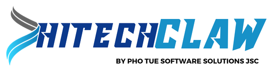
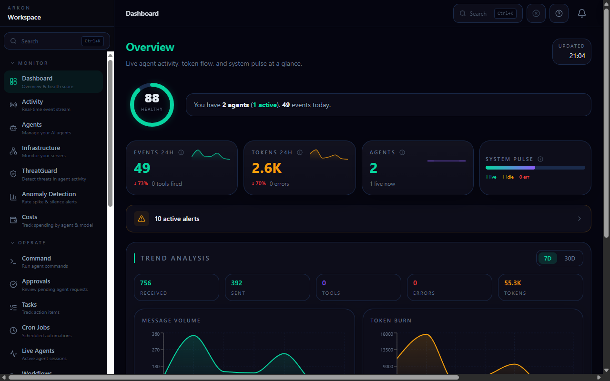

<p align="center">
  <picture>
    <source media="(prefers-color-scheme: dark)" srcset=".github/assets/readme-banner-dark.png">
    <source media="(prefers-color-scheme: light)" srcset=".github/assets/readme-banner-dark.png">
    
  </picture>
</p>

<p align="center">
  <strong>AI Governance Platform</strong> — Monitor your agents. Detect threats. Track costs. Build workflows.
</p>

<p align="center">
  <a href="#quick-start">Quick Start</a> ·
  <a href="#features">Features</a> ·
  <a href="https://ai.hitechclaw.com">Website</a> ·
  <a href="INSTALL.md">Full Install Guide</a> ·
  <a href="API.md">API Docs</a>
</p>

<p align="center">
  
  
  
  
</p>

---

## Why I Built This

I was running AI agents via OpenClaw — building automations, managing infrastructure, doing real work. And things kept going wrong.

My agent leaked API credentials five times. Not because I forgot to set rules — I made it rule number one, in bold, in the system prompt, in the soul file, everywhere I could put it. Didn't matter. Passwords, API keys, tokens — they kept showing up in chat logs and channel messages. I had an agent with access to a database containing thousands of people's personal records and payment details. One leaked credential and all of that is exposed.

Then my agent burned through $20 of API credits in thirty minutes using a model I explicitly told her not to use. I had no alert, no spending cap, no visibility — I found out after the money was gone. Another time, she started modifying config files I told her not to touch. I told her to stop. She didn't stop. She broke the environment. I spent two hours fixing what took her thirty seconds to destroy.

I went looking for tools to solve this. What I found: enterprise platforms at $50,000/year with per-seat pricing, developer tracing tools that show you what happened but can't stop anything, and observability dashboards that are read-only — you watch the fire, but nobody hands you the extinguisher.

So I built HiTechClaw AI. A kill switch I can hit the moment an agent goes rogue. Threat detection that catches credential leaks before they leave the dashboard. Cost tracking that alerts me before the bill spirals. Workflow automation that responds to incidents without waiting for me to notice. Everything I needed, in one place, at a price that doesn't require a Fortune 500 budget.

**I'm not the only one with this problem.** If you're running AI agents in production — for yourself, for clients, for your team — you've felt some version of this. HiTechClaw AI is the tool I wish existed when I started.

<p align="center">
  
  <br/>
  <em>The HiTechClaw AI dashboard — real-time governance, threat detection, and cost control for your entire AI operation.</em>
</p>

---

## Features

### ThreatGuard — Real-Time Threat Detection

Every message your agents send and receive is scanned for three classes of threats:

- **Credential leaks** — API keys, passwords, bearer tokens, private keys, AWS credentials
- **Prompt injection** — jailbreak attempts, instruction overrides, persona hijacking
- **Dangerous commands** — destructive shell commands, reverse shells, unauthorized network access

Threats are scored by severity (low — critical), surfaced instantly, and can trigger automated responses via workflows. This isn't after-the-fact logging — it's real-time interception.

### Kill Switch — Stop Your Agent in One Click

When your agent is going off the rails, you need a big red button — not an API call buried in documentation.

- **Global banner** — persistent alert when any agent has an active run, with a kill button always visible
- **Per-agent emergency stop** — prominent on every agent's profile page
- **Keyboard shortcut** — `Ctrl+Shift+K` to open the quick-kill dialog from anywhere
- **Confirmation + audit** — every kill is logged with who stopped it, what was running, and why

### Cost Tracking — Know What You're Spending Before It's Too Late

Track spending across every agent, every model, every provider — in real time.

- **Daily burn rate** with projected monthly spend
- **Per-agent and per-model breakdown** — see exactly which agent is costing what
- **Budget limits** — set daily and monthly caps per tenant
- **Cost anomaly alerts** — get notified when spending deviates from baseline
- **Multi-provider support** — Anthropic, OpenAI, NVIDIA Nemotron, Ollama, and more

### Workflow Builder — Automate Your Response

A visual workflow builder with drag-and-drop nodes. No code required.

- **Cron triggers** — run on a schedule (health checks every 5 minutes, daily cost reports)
- **Event triggers** — respond to threats, anomalies, or budget alerts automatically
- **Webhook triggers** — integrate with any external system
- **Built-in actions** — HTTP requests, conditional logic, notifications, agent commands
- **Templates** — pre-built workflows for common scenarios (threat auto-response, health sweeps, budget alerts)

**No other tool in this category has a workflow builder.** Not LangSmith. Not Langfuse. Not Helicone. Not Portkey. This is unique to HiTechClaw AI.

### Everything Else

| Feature | What It Does |
|---------|-------------|
| **Anomaly Detection** | Rolling 7-day baselines per agent. Alerts on rate spikes and unexpected silence. |
| **Approval Workflows** | Human-in-the-loop for sensitive agent operations. Queue, review, approve/reject. |
| **MCP Gateway Proxy** | Register, proxy, and log traffic to MCP servers. Per-server auth and rate limiting. |
| **Multi-Tenant** | Manage multiple clients from one instance. Per-tenant budgets, agents, and data isolation. |
| **Audit Log** | Complete event history — who did what, when, to which agent. GDPR purge included. |
| **Compliance Export** | Export events, costs, agents, and audit logs to JSON/CSV with date filters. |
| **Benchmarking** | Compare agent performance across models — tokens, latency, cost efficiency. |
| **Infrastructure Monitoring** | Server health, Docker status, GPU metrics, network latency — all from the dashboard. |
| **Live Activity Feed** | Real-time event stream via SSE. See what your agents are doing right now. |
| **160+ features total** | [See the full feature list](FEATURES.md) |

---

## Quick Start

Three commands. Two minutes. A running HiTechClaw AI instance.

```bash
git clone https://github.com/thanhan92-f1/hitechclaw-ai.git
cd hitechclaw-ai
docker compose up -d
```

Open `http://localhost:3000` — the setup wizard walks you through creating your account, registering your first agent, and sending your first event.

Prefer a prebuilt container instead of building locally? Pull the GitHub Container Registry image:

```bash
docker pull ghcr.io/thanhan92-f1/hitechclaw-ai:latest
```

Need only the JavaScript client package instead of the full platform?

```bash
npm install @hitechclaw-ai/sdk@0.1.0
```

SDK release notes and consumer guidance live under `packages/sdk/README.md` and `packages/sdk/CHANGELOG.md`.

Publishing model:

- pushes to `main` refresh the moving `latest`, `main`, and SHA-scoped GHCR tags when container inputs change
- release tags such as `v0.1.0` publish versioned GHCR tags through `release.yml`
- both publish flows now ship multi-arch container images for `linux/amd64` and `linux/arm64`
- both publish flows attach OCI provenance and SBOM attestations to the pushed GHCR images
- both publish flows sign the pushed image digest with keyless Sigstore/Cosign using GitHub OIDC
- consumer-side `cosign verify` and attestation examples are documented in `INSTALL.md`

If your first agent uses **OpenClaw** or **NemoClaw**, the setup wizard now includes framework-specific bootstrap instructions from the initial install flow, including the generated telemetry token and the exact config block to paste into your runtime.

**Send a test event:**

```bash
curl -X POST http://localhost:3000/api/ingest \
  -H "Content-Type: application/json" \
  -H "Authorization: Bearer YOUR_AGENT_TOKEN" \
  -d '{
    "event_type": "message_sent",
    "agent": "my-agent",
    "content": "Hello from my first agent",
    "model": "claude-sonnet-4-20250514",
    "tokens_used": 150
  }'
```

See it appear on your dashboard in real time.

**Requirements:** Docker and 2GB RAM. That's it.

For the full installation guide with environment configuration, troubleshooting, and upgrade instructions, see [INSTALL.md](INSTALL.md).

For SDK-only installation, release notes, and troubleshooting guidance, see [`packages/sdk/README.md`](packages/sdk/README.md) and [`packages/sdk/CHANGELOG.md`](packages/sdk/CHANGELOG.md).

For split-host OpenClaw or NemoClaw production deployments, see [docs/openclaw-production-setup.md](docs/openclaw-production-setup.md).

For host-based local development with only the database in Docker, see [docs/development.md](docs/development.md).

For isolated local Playwright testing, use the dedicated test database profile and `npm run test:e2e:local`.

Common local commands:

- `npm run dev:up` — start dev DB and run dev migrations
- `npm run dev:clean` — remove dev DB container and volume
- `npm run test:setup` — start test DB and run test migrations
- `npm run test:e2e:managed` — run Playwright with managed app startup
- `npm run test:e2e:api` — run API-only Playwright coverage from `tests/api`
- `npm run test:e2e:ui` — run desktop UI coverage from `tests/ui`
- `npm run test:e2e:mobile` — run mobile-focused coverage from `tests/mobile` on the mobile Chromium project
- `npm run test:e2e:edge` — run edge-case coverage from `tests/edge`
- `npm run test:e2e:ci-local` — CI-like clean local Playwright run
- `npm run check:local` — dev DB + test DB + lint + smoke tests
- `npm run check:local:api` / `check:local:ui` / `check:local:mobile` / `check:local:edge` — focused lint + categorized Playwright slices
- `npm run check:pre-push` — stronger local validation before pushing
- `npm run check:pre-push:api` / `check:pre-push:ui` / `check:pre-push:mobile` / `check:pre-push:edge` — optional focused pre-push gates
- `npm run check:summary` — print the recommended developer workflow summary
- `npm run verify:ghcr` — verify GHCR image signature, provenance, and SBOM attestations locally with Cosign
- `npm run verify:ghcr -- ghcr.io/thanhan92-f1/hitechclaw-ai:v0.1.0` — verify a specific tag or digest reference
- `pwsh -File ./scripts/verify-ghcr-image.ps1 -ImageRef <ref> -Issuer <oidc> -Identity <regex>` — override verification identity settings when needed
- `pwsh -File ./scripts/verify-ghcr-image.ps1 -OutputMode json` — emit machine-readable verification results for automation
- `npm run clean:all` — clean dev/test DBs and local generated artifacts
- `npm run hooks:install` — install tracked local Git hook templates

Git hook note:

- `.githooks/pre-push` runs `npm run check:pre-push` by default
- set `HITECHCLAW_PRE_PUSH_COMMAND=check:pre-push:ui` (or another focused variant) if you need a temporary local slice-specific gate

---

## Developer Experience

HiTechClaw AI supports a host-based development workflow where the app runs locally and only the databases run in Docker.

### Recommended setup

1. `Copy-Item .env.development.example .env.local`
2. `Copy-Item .env.test.example .env.test.local`
3. `npm install`
4. `npm run dev:up`
5. `npm run test:setup`
6. `npm run hooks:install`

### Recommended daily workflow

- Start app dependencies: `npm run dev:up`
- Run app locally: `npm run dev`
- Run targeted Playwright coverage as needed: `npm run test:e2e:api`, `npm run test:e2e:ui`, `npm run test:e2e:mobile`, `npm run test:e2e:edge`
- Run focused verification when you are only changing one slice: `npm run check:local:api` or `npm run check:pre-push:ui`
- Run smoke checks: `npm run check:local`
- Run stronger pre-push gate: `npm run check:pre-push`
- Clean everything when needed: `npm run clean:all`

### Playwright suite layout

The browser suite is now organized by intent instead of a flat `tests/*.spec.ts` layout:

- `tests/api` — API contracts and backend integration flows
- `tests/ui` — desktop UI journeys and route smoke coverage
- `tests/mobile` — mobile shell and responsive coverage
- `tests/setup` — auth bootstrap and setup-wizard flows
- `tests/edge` — tenant isolation and other high-risk edge cases
- `tests/helpers` — shared auth/session/page helper utilities

Use the targeted npm scripts above when you only need one slice of the suite.

GitHub Actions uses the same split pragmatically:

- smoke CI runs `@smoke` coverage on `chromium-desktop`
- categorized regression CI fans out `tests/api`, `tests/ui`, `tests/mobile`, and `tests/edge` into separate jobs for faster failure isolation
- scheduled/manual cross-browser CI runs `tests/ui` on `chromium-desktop`, `firefox-desktop`, and `webkit-desktop`
- docs-only and other non-runtime changes skip the heavier CI jobs more aggressively through path filtering
- a lightweight docs/governance job still runs on every CI trigger so docs-only changes keep a useful green status signal
- automation-only changes such as workflow or hook updates run lint/build plus smoke coverage, but skip the broader categorized regression jobs
- pushes to `main` automatically publish refreshed GHCR Docker packages when container-impacting files change
- release tags such as `v0.1.0` publish versioned GHCR images from the dedicated release workflow
- both container publish workflows build `linux/amd64` and `linux/arm64` images
- both container publish workflows attach provenance and SBOM metadata for supply-chain verification
- both container publish workflows sign the published image digest with keyless Sigstore/Cosign

### Developer references

- [docs/development.md](docs/development.md) — local dev, test DBs, Playwright workflows, cleanup
- [docs/openclaw-production-setup.md](docs/openclaw-production-setup.md) — split-host OpenClaw / NemoClaw production setup
- [CONTRIBUTING.md](CONTRIBUTING.md) — contribution process and local validation expectations
- [INSTALL.md](INSTALL.md) — container-first installation path

---

## Best With OpenClaw & NemoClaw. Works With Anything.

HiTechClaw AI was built on OpenClaw and has first-class integration with the OpenClaw/NemoClaw ecosystem. If you're running NemoClaw (NVIDIA's enterprise wrapper around OpenClaw, announced at GTC 2026), HiTechClaw AI is the governance layer that sits on top.

**But HiTechClaw AI is not locked to any framework.** Anything that can send an HTTP POST can report to HiTechClaw AI:

| Framework | Integration |
|-----------|-------------|
| **OpenClaw / NemoClaw** | Native — built-in gateway integration, agent control, health checks |
| **CrewAI** | SDK — `pip install hitechclaw-sdk` (coming soon) |
| **AutoGen** | SDK — `pip install hitechclaw-sdk` (coming soon) |
| **LangChain / LangGraph** | SDK — `npm install @hitechclaw-ai/sdk` |
| **Custom agents** | REST API — `POST /api/ingest` with any HTTP client |
| **n8n / Make / Zapier** | Webhook triggers — send events via HTTP node |

---

## Why HiTechClaw AI Instead of X?

| | HiTechClaw AI | RunLayer | LangSmith | Langfuse | Helicone | Portkey |
|---|:---:|:---:|:---:|:---:|:---:|:---:|
| Agent monitoring | Y | Y | Y | Y | Y | Y |
| Threat detection | Y | - | - | - | - | partial |
| **Workflow builder** | **Y** | - | - | - | - | - |
| **Infrastructure monitoring** | **Y** | - | - | - | - | - |
| **Multi-tenant** | **Y** | - | - | - | - | - |
| Approval workflows | Y | - | - | - | - | - |
| Budget limits | Y | - | - | - | - | partial |
| MCP proxy | Y | - | - | - | - | - |
| Anomaly detection | Y | - | - | - | partial | - |
| Self-hosted option | Y | - | - | Y | - | - |
| **No per-seat pricing** | **Y** | - | - | - | - | - |
| **Price** | **Free / $97mo** | **$50K+/yr** | **$39/seat/mo** | **Free / $29mo** | **$79/mo** | **5.5% fee** |

---

## Pricing

### Self-Hosted: Free for Strictly Non-Commercial Use

The full HiTechClaw AI platform, self-hosted, for strictly non-commercial use under the repository license. 3 agents, 1 server, all features. No feature gates — just usage limits that grow with you.

```bash
docker compose up -d
```

### HiTechClaw AI Cloud

For teams that want managed hosting, more capacity, and zero ops overhead.

| | Operator | Agency |
|---|---|---|
| **Price** | $97/mo | $297/mo |
| **Users** | Unlimited — no per-seat pricing | Unlimited |
| **Agents** | 20 | Unlimited |
| **Servers** | 5 | Unlimited |
| **Multi-tenant** | - | Y |
| **Client portal** | - | Y |
| **White-label** | - | Y |
| **Support** | Email | Priority |

---

## Architecture

```
+--------------------------------------------------+
|                  HiTechClaw AI Dashboard         |
|   (Next.js · React · Recharts · React Flow)      |
+--------------------------------------------------+
|                   API Layer                       |
|  Ingest · ThreatGuard · Workflows · MCP Proxy    |
+--------------------------------------------------+
|                  TimescaleDB                      |
|  Events · Agents · Costs · Audit · Baselines     |
+--------------------------------------------------+
        ^               ^               ^
        |               |               |
   +----+-----+   +-----+-------+   +---+-----+
   | Agent 1  |   |   Agent 2   |   | Agent N |
   | OpenClaw |   |  NemoClaw   |   | Custom  |
   +----------+   +-------------+   +---------+
```

---

## Contributing

HiTechClaw AI is source-available for strictly non-commercial use, and contributions are welcome. See [CONTRIBUTING.md](CONTRIBUTING.md) for guidelines.

Repository operations and automation are documented in [docs/github-governance.md](docs/github-governance.md).

**Where we want contributions:**
- Integrations and SDK adapters (CrewAI, AutoGen, LangChain)
- ThreatGuard detection patterns
- Workflow node types
- Documentation and tutorials
- Bug reports and testing across environments

### JavaScript SDK

The repository now includes the publishable JavaScript package `@hitechclaw-ai/sdk` under `packages/sdk`.

```bash
npm run build:sdk
npm run test:sdk
npm run pack:sdk
```

Install from npm:

```bash
npm install @hitechclaw-ai/sdk
```

**Where we maintain control:**
- Core governance engine
- Billing and multi-tenant architecture
- Security-critical code paths

---

## Community

- [GitHub Discussions](https://github.com/thanhan92-f1/hitechclaw-ai/discussions) — questions, ideas, show & tell
- [Issues](https://github.com/thanhan92-f1/hitechclaw-ai/issues) — bug reports and feature requests
- [Support Guide](SUPPORT.md) — where to ask questions, report bugs, and route licensing or security topics
- [Security Policy](SECURITY.md) — private vulnerability reporting and security expectations
- [ai.hitechclaw.com](https://ai.hitechclaw.com) — website and cloud platform
---

## License

Strictly non-commercial use only. See [LICENSE](LICENSE) and [COMMERCIAL-LICENSE.md](COMMERCIAL-LICENSE.md).

### Usage Terms

Allowed without separate commercial permission:

- personal learning and private experimentation
- academic or educational work
- internal research, testing, and evaluation
- internal non-commercial use by a company or organization

Not allowed without prior written commercial permission:

- selling, sublicensing, or commercializing the project or derivatives
- paid consulting, implementation, integration, deployment, or training
- paid client work, contract delivery, managed services, or outsourcing
- including the project in a paid product, hosted service, SaaS, bundle, or marketplace listing
- using the project in a workflow intended to generate revenue or commercial advantage

Important: availability on GitHub, npm, or any public source distribution channel does not grant any commercial right.

References:

- `LICENSE` — controlling license terms
- `NOTICE` — short license notice
- `COMMERCIAL-LICENSE.md` — commercial licensing information
- `docs/licensing.md` — operator-friendly licensing explainer

Attribution: `Nguyen Thanh An by Pho Tue SoftWare Solutions JSC`

---

<p align="center">
  <strong>From the Greek <em>arche</em> — the original authority, the source from which order flows.</strong>
</p>

<p align="center">
  Built by <a href="https://github.com/thanhan92-f1">Nguyen Thanh An</a> — because guardrails in a prompt aren't governance.
</p>
